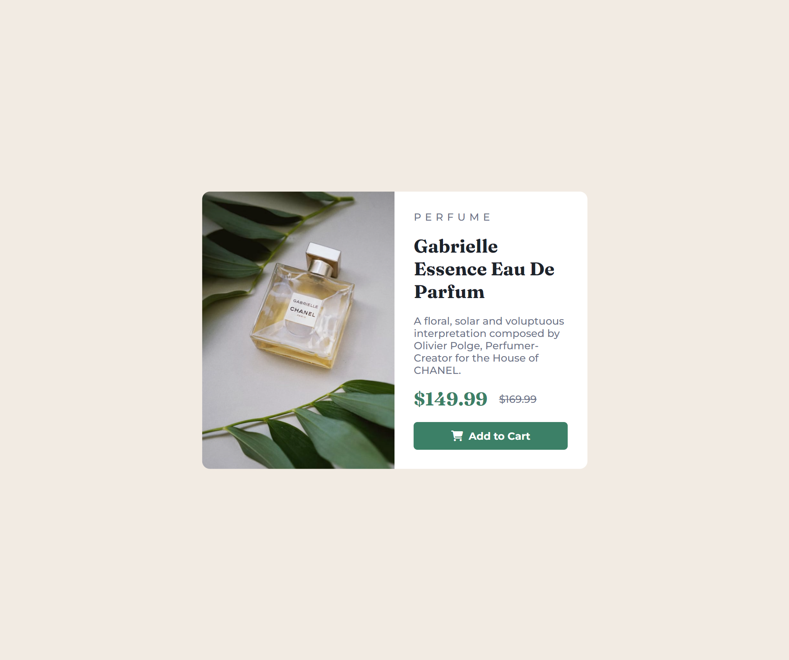

# Frontend Mentor - Product preview card component solution

This is a solution to the [Product preview card component challenge on Frontend Mentor](https://www.frontendmentor.io/challenges/product-preview-card-component-GO7UmttRfa). Frontend Mentor challenges help you improve your coding skills by building realistic projects. 

## Table of contents

- [Overview](#overview)
  - [The challenge](#the-challenge)
  - [Screenshot](#screenshot)
  - [Links](#links)
- [My process](#my-process)
  - [Built with](#built-with)
  - [What I learned](#what-i-learned)
  - [Useful resources](#useful-resources)
- [Author](#author)
- [Acknowledgments](#acknowledgments)


## Overview

### The challenge

Users should be able to:

- View the optimal layout depending on their device's screen size
- See hover and focus states for interactive elements

### Screenshot

-Desktop View:


-Mobile View
.png)

### Links

- [Solution](https://github.com/WebPioneerPro/product-preview-card-component-solution)
- [Live Site](https://webpioneerpro.github.io/product-preview-card-component-solution/)

## My process

### Built with

- Semantic HTML5 markup
- CSS custom properties
- Flexbox
- Mobile-first workflow
- [Font Awesome](https://fontawesome.com/) - For icons

### What I learned

In the process of completing this project, a key takeaway was the utilization of the `background-image` property within a `div` container to handle the display of images. This approach offers greater flexibility and control over the visual presentation, particularly when compared to the traditional `img` tag.

#### Dynamic Image Swapping for Responsive Design

I learned to dynamically swap the background image based on the device's screen size, enhancing the overall responsiveness of the card component. Leveraging media queries, I adjusted the background image to ensure optimal visual representation on both desktop and mobile devices.
```css
@media screen and (max-width: 500px) {
    .product_image {
        height: 50%;
        width: 100%;
        border-radius: 10px 10px 0 0;
        background-image: url(./images/image-product-mobile.jpg);
    }
}
```

#### CSS Background Properties

I delved into the various background properties available in CSS, such as `background-position`, `background-repeat`, and `background-size`. These properties allowed me to fine-tune the appearance of the background image within the `div` container.

```css
.product_image {
    width: 50%;
    background-image: url(./images/image-product-desktop.jpg);
    background-position: center;
    background-repeat: no-repeat;
    background-size: cover;
    border-radius: 10px 0 0 10px;
}
```
#### Improved Aesthetics and Design Control

By using the background-image property, I gained increased design control and the ability to seamlessly integrate the image with other elements. This approach provided a cleaner HTML structure and facilitated a more organized and modular design.

```html
<div class="product_image"></div>
```

This experience reinforced the importance of choosing the right technique for image handling in different scenarios, allowing for more efficient and visually appealing solutions.

### Useful resources

- [Font Awesome](https://fontawesome.com/) - Used for icons.
- [CSS Tricks](https://css-tricks.com/) -  A helpful resource for various CSS techniques.

## Author

- Github - [Prabhanjan Sahu](https://github.com/WebPioneerPro)
- Frontend Mentor - [@WebPioneerPro](https://www.frontendmentor.io/profile/WebPioneerPro)

## Acknowledgments

I would like to acknowledge the [Frontend Mentor](https://www.frontendmentor.io/home) community for providing this challenge and my peers for their support and inspiration during this project.
